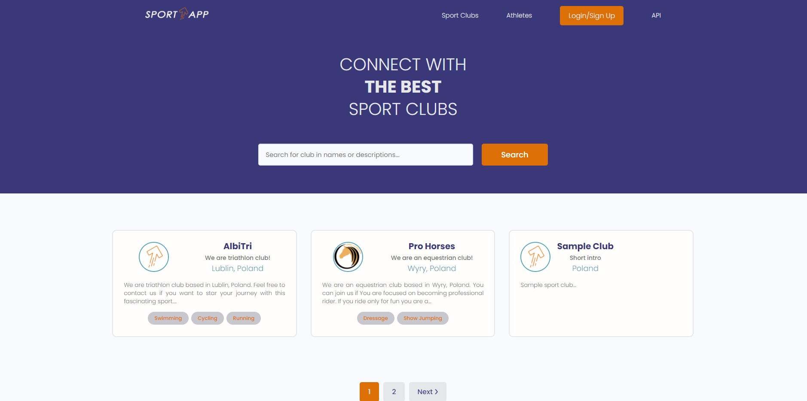
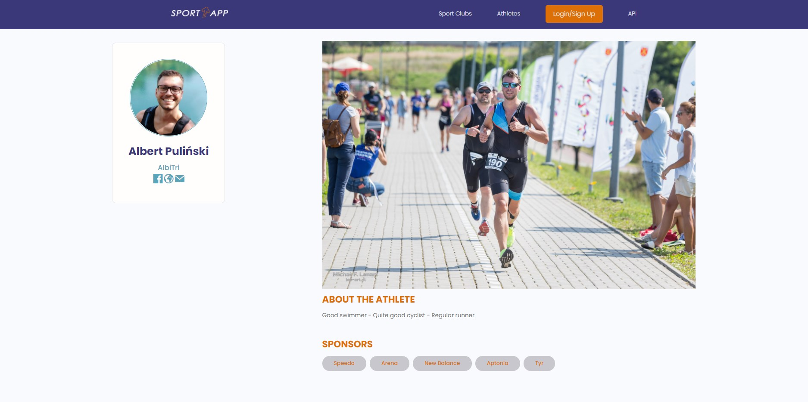
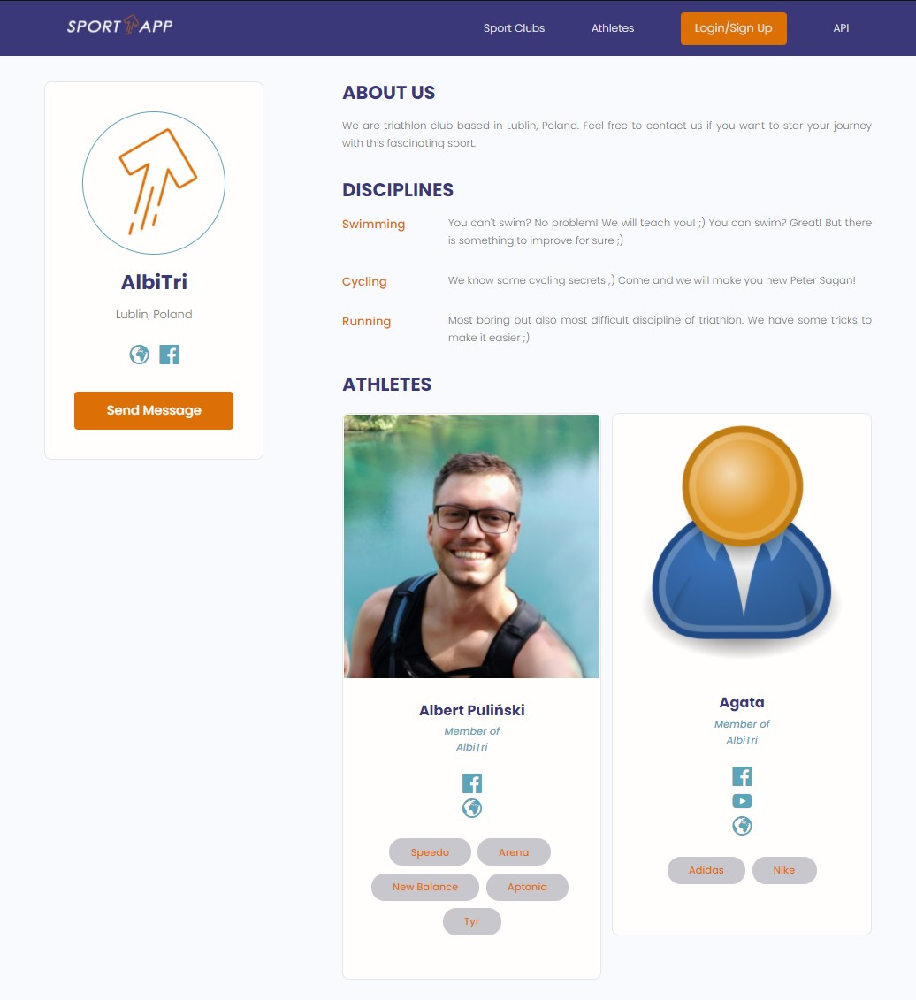
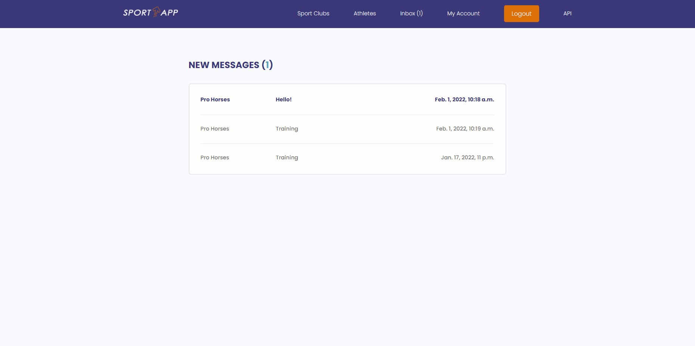
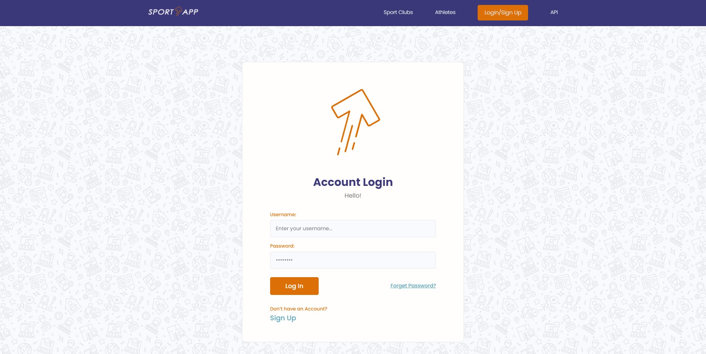
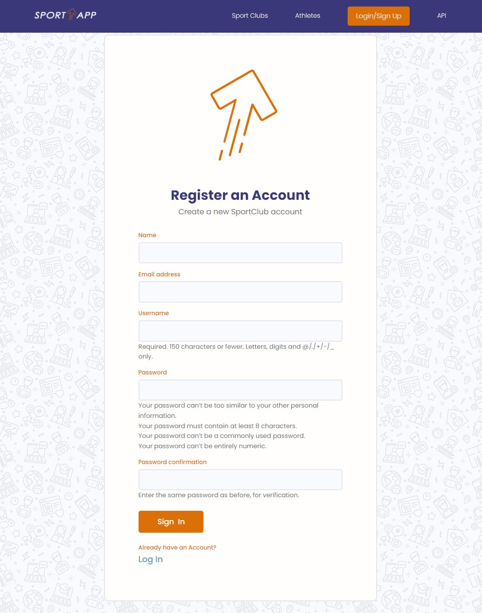
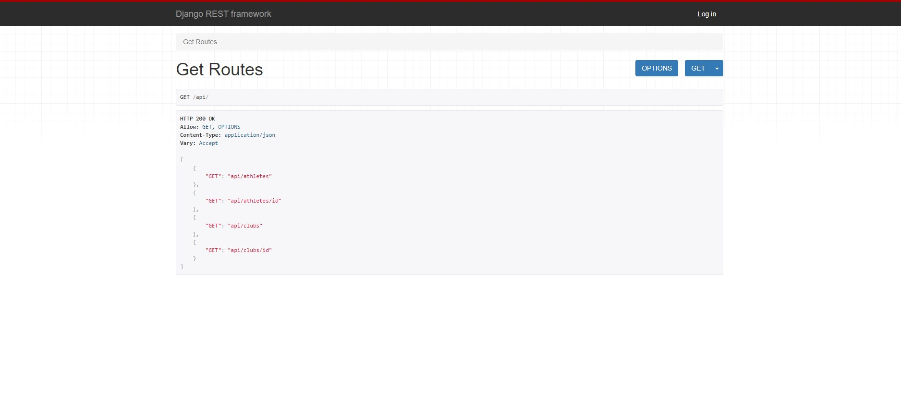

# SportApp

See this website here: https://sportclubsapp.herokuapp.com

# Installation
* 1 - clone repo https://github.com/albertopul/sportapp
* 2 - create a virtual environment and activate
*  - pip install virtualenv
*  - virtualenv envname
*  - envname\scripts\activate
* 3 - cd into project "cd sportapp"
* 4 - pip install -r requirements.txt
* 5 - python manage.py runserver

# Features
* Share Sport club profiles
* Message other clubs
* Search other clubs and athletes
* User Registration & Authenticaiton
* Building an API with Django REST Framework (DRF)

# Tech Stack
* Django
* Postgres on AWS
* Django REST Framework

# Home Page
  

# Athlete Page
  

# Club Page
  

# Club Inbox
  

# Login Page

# Registration Page

# API Page

